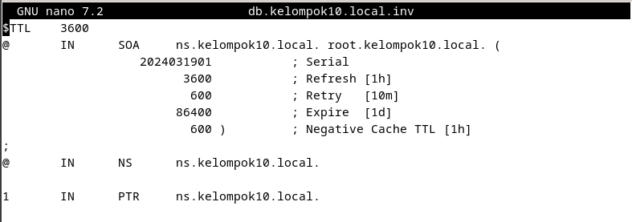
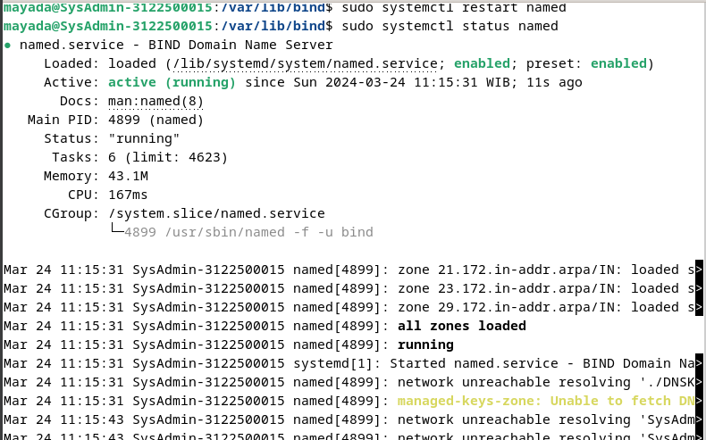
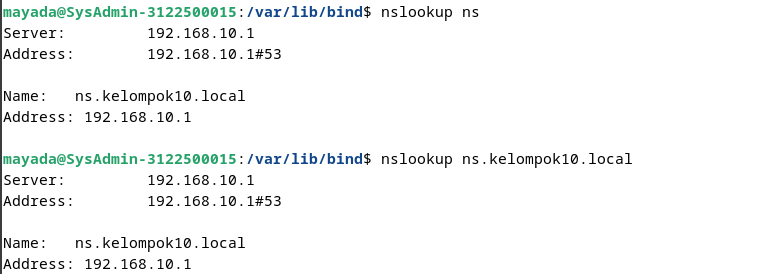

## 3. Instalasi DNS server
sumber : https://wiki.debian.org/Bind9#Debian_Bookworm

```
sudo apt install bind9 bind9-doc bind9-dnsutils 
```
<div align="center">
    <br>
    <em style="font-size:10px"></em>
</div><br>

```
cd /etc/bind
ls -al
```
<div align="center">
    <br>
    <em style="font-size:10px"></em>
</div><br>

```
sudo nano /etc/bind/named.conf
```
<div align="center">
    <br>
    <em style="font-size:10px"></em>
</div><br>

```
sudo nano /etc/bind/named.conf.default-zones
```
<div align="center">
    <br>
    <em style="font-size:10px"></em>
</div><br>

```
sudo nano /etc/bind/named.conf.options
```
<div align="center">
    <br>
    <em style="font-size:10px"></em>
</div><br>

```
sudo nano /etc/bind/named.conf.local
```
<div align="center">
    <br>
    <em style="font-size:10px"></em>
</div><br>

```
sudo named-checkconf /etc/bind/named.conf
```
<div align="center">
    <br>
    <em style="font-size:10px"></em>
</div><br>

```
pindah ke : cd /var/lib/bind/
sudo nano db.kelompok11.local
```
<div align="center">
    <br>
    <em style="font-size:10px"></em>
</div><br>

```
sudo named-checkzone kelompok10.local db.kelompok10.local
```
<div align="center">
    <br>
    <em style="font-size:10px"></em>
</div><br>

```
sudo nano db.kelompok10.local.inv
```
<div align="center">
    <br>
    <em style="font-size:10px"></em>
</div><br>

```
sudo named-checkzone 10.168.192.inaddr-arpa db.kelompok10.local.inv
```
<div align="center">
    <br>
    <em style="font-size:10px"></em>
</div><br>

```
sudo nano /etc/network/interfaces
```
<div align="center">
    <br>
    <em style="font-size:10px"></em>
</div><br>

```
sudo nano /etc/resolv.conf
```
<div align="center">
    <br>
    <em style="font-size:10px"></em>
</div><br>

```
sudo systemctl restart named
sudo systemctl status named
```
<div align="center">
    <br>
    <em style="font-size:10px"></em>
</div><br>

```
dig kelompok10.local
```
<div align="center">
    <br>
    <em style="font-size:10px"></em>
</div><br>

```
dig -x 192.168.10.1
```
<div align="center">
    <br>
    <em style="font-size:10px"></em>
</div><br>

```
nslookup ns
nslookup ns.kelompok10.local
```
<div align="center">
    <br>
    <em style="font-size:10px"></em>
</div><br>

```
nslookup 192.168.10.1
```
<div align="center">
    <br>
    <em style="font-size:10px"></em>
</div><br>
</div>