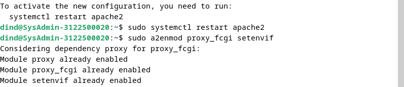
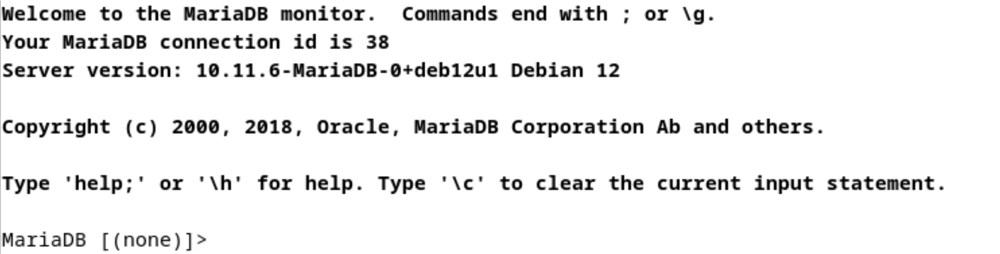
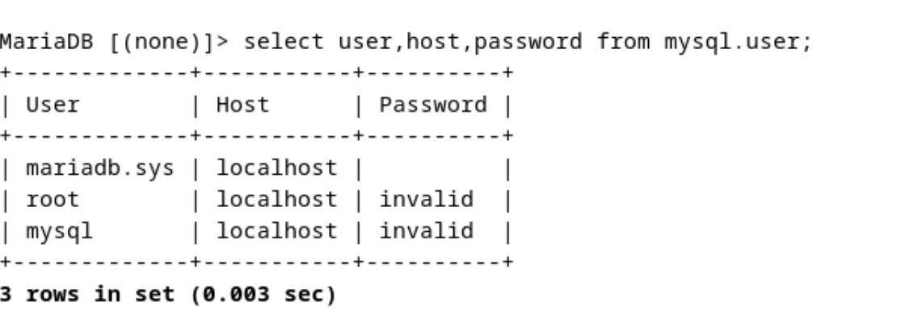
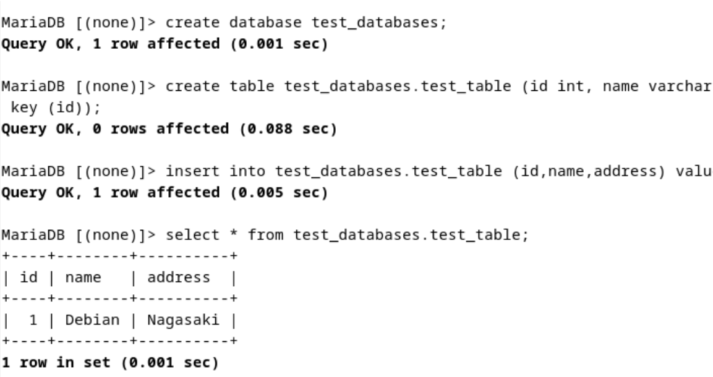
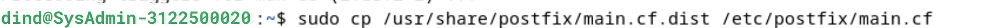
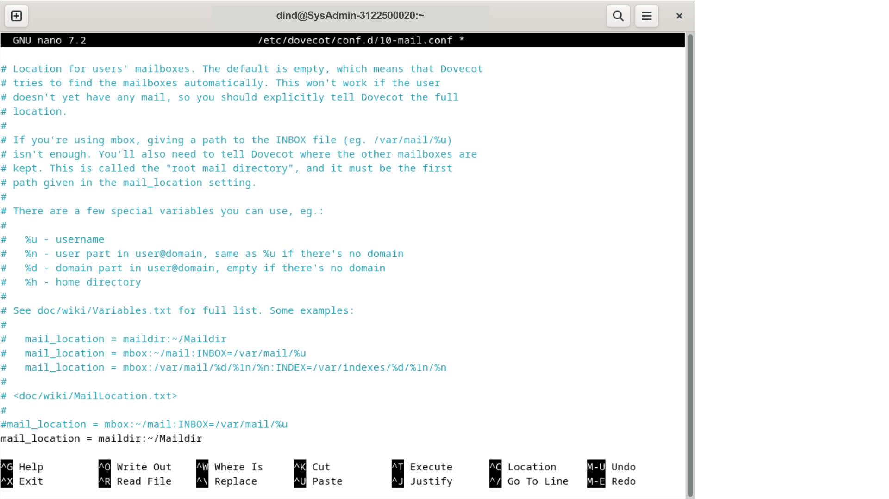
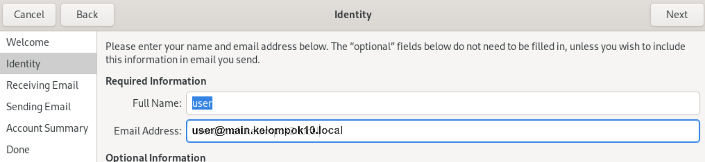
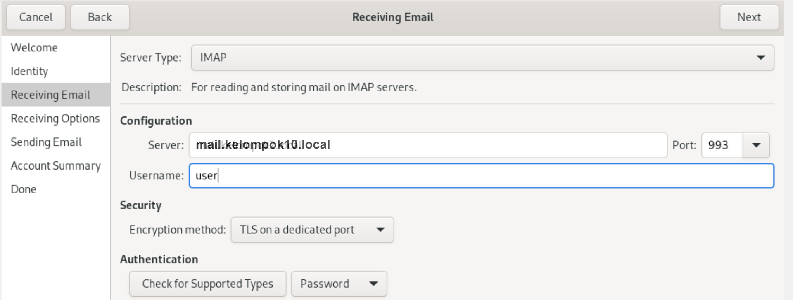
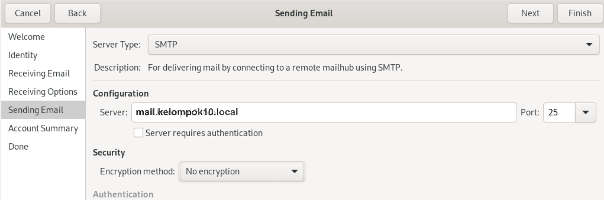
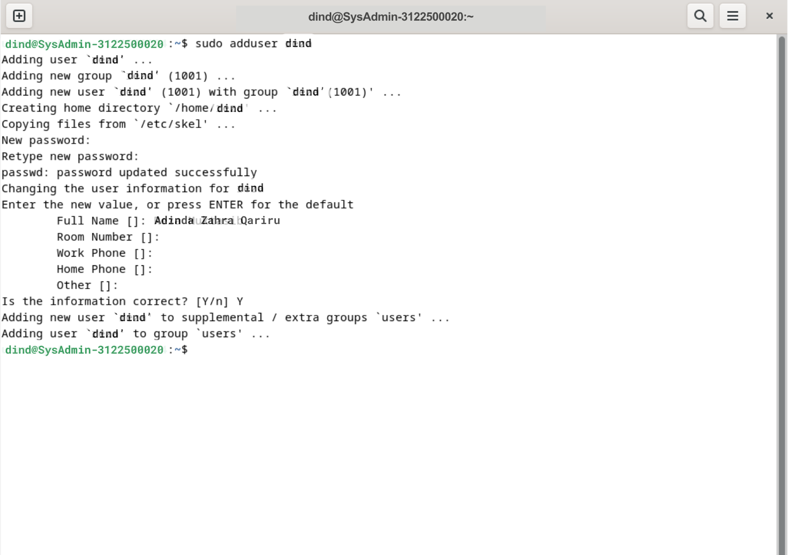

<h1 align="center">LAPORAN WORKSHOP ADMINISTRASI JARINGAN</h1>

<h3 align="center">Dosen Pembimbing: Dr. Ferry Astika Saputra ST, M.Sc</h3>

<p align="center"></p>

<div align="center">
  <h3>Disusun Oleh:</h3>
  <p align="center">Adinda Zahra Qariru 3122500020</p>
</div>

<div align="center">
  <h3>PROGRAM STUDI TEKNIK INFORMATIKA <br>
      POLITEKNIK ELEKTRONIKA NEGERI SURABAYA <br>
      TAHUN 2023/2024 <br>
  </h3>
</div>

##

### Note
Pastikan BIND9 pada praktikum sebelumnya sudah terinstall dan terkonfigurasi sesuai dengan custom domain kelompok.

**Kembalikan debian dalam keadaan Network NAT dan IP DNS Automatic agar terkoneksi dengan internet.** <br>

- Atur server email pada konfigurasi zona agar dapat diakses melalui ```mail.kelompok10.local.``` <br>
    <br>
    <br>
    <br>
    <br>
- Selanjutnya, gunakan perintah ```nslookup``` untuk melakukan pengecekan.
  <br>

#

### A. Setup NTP ( Network Time Protocol )

1. Mulailah dengan menginstal paket systemd-timesyncd 
   ```
   sudo apt install systemd-timesyncd
   sudo timedatectl set-timezone Asia/Jakarta
   ```
   <br>
2. Ubahlah zona waktu menjadi Asia/Jakarta dan sesuaikan RTC dengan UTC dan aktifkan NTP untuk sinkronisasi waktu.
   ```
   sudo timedatectl set-local-rtc false
   sudo timedatectl set-ntp true
   ```
   <br>
3. Konfigurasikan file ```timesync.d``` untuk menggunakan pool NTP terdekat guna meminimalkan delay.
   ```
   sudo nano /etc/systemd/timesyncd.conf
   ```
   <br>
   <br>
4. Lakukan restart layanan dan periksa statusnya. 
   ```
   sudo systemctl restart systemd-timesyncd
   sudo systemctl status systemd-timesyncd
   ```
   <br>
   Pastikan tanggal sudah terupdate!
   ```
   sudo timedatectl
   ```
   <br>

#

### B. Instalasi dan Konfirgurasi Apache2

1. Instal Apache2
   ```
   sudo apt -y install apache2
   ```
   <br>
2. Konfigurasi Apache2 dengan mengubah pengaturan ServerToken menjadi "Prod".
   ```
   sudo nano /etc/apache2/conf-enabled/security.conf
   ```
   <br>
   <br>
3. Tambahkan direktori yang dapat diakses.
   ```
   sudo nano /etc/apache2/mods-enabled/dir.conf
   ```
   <br>
   <br>
4. Atur Servernamenya.
   ```
   sudo nano /etc/apache2/apache2.conf
   ```
   <br>
   <br>
5. Pastikan email webmaster telah ditetapkan.
   ```
   /etc/apache2/sites-enabled/000-default.conf
   ```
   <br>
   <br>
6. Lakukan reload layanan Apache2.
   ```
   sudo systemctl reload apache2
   ```
   <br>
7. Periksa apakah webserver berjalan dengan membuka browser. Tapi sebelumnya ubah dulu IP dan DNS sesuai dengan yang sudah diset sebelumnya!<br>
   <br>
   <br>
   **Apache berhasil diakses!**

#

### C. Instalasi PHP 8.2

1. Instal PHP 8.2
   ```
   sudo apt -y install php8.2 php8.2-mbstring php-pear
   ```
   <br>
2. periksa apakah instalasi berhasil.
   ```
   php -v
   ```
   <br>
3. Buat file PHP untuk menguji apakah PHP berjalan dengan baik seperti di bawah ini
   <br>
4. Jalankan dengan command berikut
   ```
   php test.php | head
   ```
   <br>

#

### D. Instalasi dan Konfigurasi PHP-FM

1. Instal PHP FM 
   ```
   sudo apt -y install php-fpm
   ```
   <br>
2. Konfigurasikan file Apache untuk PHP-FM.
   ```
   sudo nano /etc/apache2/sites-available/default-ssl.conf
   ```
   <br>
   <br>
3. Jalankan ulang layanan.<br>
   <br>
   <br>
4. Uji coba webserver dengan membuat ```file info.php```.
   <br>
5. Cek pada web, jangan lupa kembalikan ke IP dan DNS manual untuk mengakses internet.<br>
   <br>
   Berhasil!

#

### E. Instalasi Database server ( Mariadb-Server )

1. Instal paket Mariadb-Server 
   <br>
2. Pastikan pengaturan charset sesuai.
   ```
   nano /etc/mysql/mariadb.conf.d/50-server.cnf
   ```
   <br>
3. Lakukan restart ariadb lalu konfigurasi mariadb
   ```
   sudo mysql_secure_installation
   ```
   <br>
   Instalasi patter: pastikan sama sehingga langkah tetap sama.
   ```
   Enter current password for root (enter for none): Tekan Enter
   Switch to unix_socket authentication [Y/n] n
   Change the root password? [Y/n] n
   Remove anonymous users? [Y/n] y
   Disallow root login remotely? [Y/n] y
   Remove test database and access to it? [Y/n] y
   Reload privilege tables now? [Y/n] y
   ```
4. Tes konek ke mariadb dengan masuk ke dalam MySQL dan cek akses pengguna.<br>
   <br>
   <br>
5. Pastikan instalasi MySQL berhasil dengan membuat database dan tabel dummy.<br>
   <br>
6. Lihat semua database<br>
   <br>
7. Berhasil dan Database mariadb sudah terinstall.<br>
   <br>

#

### F. Instalasi dan Konfigurasi Email System POSTFIX (SMTP Server)

1. Instal Postfix. 
   ```
   sudo nano apt -y install postfix sasl2-bin
   ```
2. Konfigurasikan manual.<br>
   <br>
3. Salin file konfigurasi<br>
   <br>
4. Ubah beberapa pengaturan sebagai berikut.<br>
   <br>
   <br>
   <br>
   <br>
   <br>
   <br>
   <br>
   <br>
   <br>
   <br>
   <br>
5. Tambahkan konfigurasi anti-spam.
   <br>

#

### G. Instalasi DOVECOT (IMAP POP3)

1. Instal paket Dovecot.
   ```
   sudo  apt -y install dovecot-core dovecot-pop3d dovecot-imapd
   ```
2. Ubah listen IP yang digunakan.<br>
   <br>
3. Lakukan konfigurasi file auth dan mail.
   <br>
   <br>
4. Tambahkan mode 0666 dan user serta group pada file master.
   <br>
5. Restart layanan dan periksa statusnya di netstat
   <br>
6. Setelah beberapa paket terinstall seperti imap, pop3 kita akan coba melakukan test connection ke postfix
   ```
   telnet mail.kelompok10.local
   ```
   <br>

#

### H. DEBIAN EVOLUTION

1. Buat user dan lakukan konfigurasi identitas, penerimaan, dan pengiriman email (di saya yaitu ```user```)<br>
   - Identity<br>
   <br>
   - Receive<br>
   <br>
   - Sending<br>
   <br>
2. ```user``` telah dibuat sekarang buat user lagi (dummy) untuk saya, dind dengan langkah yang sama. adduser terlebih dahulu.
   <br>
3. Kirim email dan periksa kotak masuk.
   <br>

#

### I. ROUNDCUBE

1. Lakukan konfigurasi untuk pengguna Roundcube, tambahkan pada tabel db user<br>
   <br>
2. Berikan akses penuh.<br>
   <br>
   
   Loading<br>
   <br>
3. Instal Roundcube.
   ```
   sudo apt-get install roundcube -y
   ```
   <br>
   
   klik YES<br>
   <br>
   
   Masukkan password tadi (123)
   <br>
4. Lakukan config pada file ```/etc/roundcube/config.inc.php```. lakukan seperti di bawah ini!<br>
   <br>
5. Kemudian konfigurasi file apache pada roundcube, uncomment line 3 dan hapus public_html path<br>
   <br>
6. Pada ```apache2 default conf``` tambahkan Servername untuk mail dan document root menjadi roundcube ```sudo nano /etc/apache2/sites-available/000-default.conf```, Servername ```mail.kelompok10.local``` DocumentRoot /var/lib/roundcube/<br>
   <br>
7. Jalankan seperti berikut ini!
   <br>

   OK<br>
   <br>

   en_Us<br>
   <br>

   Install ulang => YES<br>
   <br>

   Pilih TCP/IP<br>
   <br>

   Pilih localhost<br>
   <br>

   Pilih PORT: 3306<br>
   <br>

   Pilih native password<br>
   <br>

   Database name default<br>
   <br>

   Username default<br>
   <br>

   Password 123<br>
   <br>

   Admin root<br>
   <br>

   Pilih Webserver apache2<br>
   <br>

   **Restrart and keep currently installed!**
8.  Roundcude berhasil terinstall
   <br>
9.  Login sebagai user debian kita ```user > user`` dan coba kirim email.
   <br>
   Coba kirim email
   <br>

#

### J. PERCOBAAN MAILSERVER JARINGAN JARKOM C307
1. Pastikan sudah terkoneksi dengan ethernet LAB JARKOM
2. Lakukan Ping ke 1.1.1.1 pastikan sudah terhubung ke dns 1.1.1.1
3. Setting Virtual Box Ke Dalam Network Bridge dengan cara pergi ke setting/machine >> Network
   
   <br>
   
4. Supaya DNS Kita dapat diresolve oleh kelompok lain lakukan Konfigurasi Berikut
5. Setting interfaces:
   
   <br>

6. Setting named.conf.options:
   ```
   sudo nano /etc/bind/named.conf.options
   ```
   <br>
   <br>
   <br>
7. Setting resolv.conf:
   ```
   sudo nano /etc/resolv.conf
   ```
   <br>
   <br>
8. Lakukan sudo restart systemctl networking Setelahnya
   ```
   sudo systemctl restart networking
   ```
9.  Lakukan Ping Detik.com atau IP Kelompok lain disini 192.168.10.10
    ```
    ping detik.com
    nslookup ns.kelompok2.local
    ```
10. Buat DHCP Server Bridge Pada Aplikasi WINBOX. Connect Ke Server/Router Klik DHCP SETUP, Pilih Bridge Interface
    
    <br>

11. Masukkan dns
    
    <br>

12. Cek Mail Server
    ```
    nslookup mail.kelompok10.local
    ```
13. nslookup -q=MX kelompok2.local
    <!-- <br> -->
14. Buka Mail Server Kelompok Kita
    <!-- <br> -->
15. Lakukan Pengiriman Ke Kelompok Lainnya
    
    <br>

#

### K. ANALISIS MIME(HEADER), POP3, DAN SMTP

Berikut adalah analisis singkat untuk MIME (Multipurpose Internet Mail Extensions), POP3 (Post Office Protocol version 3), dan SMTP (Simple Mail Transfer Protocol):

<p align="center">
  
</p>
<p align="center">
  MIME
</p>

1. **Multipurpose Internet Mail Extensions (MIME):**
- Apa itu MIME: <br>
  MIME adalah standar yang memungkinkan berbagai jenis informasi, seperti teks, gambar, audio, dan video, untuk disampaikan melalui protokol email. Ini memungkinkan email untuk mengirim dan menerima konten multimedia.
- Header MIME: <br>
  Header MIME terdiri dari beberapa bagian yang mengontrol bagaimana konten email diinterpretasikan oleh klien email. Beberapa header MIME umum meliputi:
  - Content-Type: Menunjukkan tipe media konten (teks, gambar, dll.).
  - Content-Disposition: Mengontrol cara konten tersebut ditampilkan atau diproses.
  - Content-Transfer-Encoding: Mengonversi data biner ke format teks agar dapat ditransmisikan melalui protokol email.
- Penggunaan MIME:
  MIME digunakan untuk menyampaikan email yang mengandung lampiran, gambar, format teks kaya, dan konten multimedia lainnya. Ini memungkinkan pengguna untuk mengirim pesan email yang lebih kaya dan lebih bervariasi.

<p align="center">
  
</p>
<p align="center">
  POP3
</p>

2. **Post Office Protocol version 3 (POP3):**
- Apa itu POP3: <br>
  POP3 adalah protokol yang digunakan untuk mengambil email dari server email ke klien email. Ini adalah salah satu protokol yang paling umum digunakan untuk mengakses email dari server.
- Cara Kerja POP3:
  1) Klien email terhubung ke server email melalui port 110.
  2) Setelah koneksi dibuat, klien mengirimkan kredensial pengguna untuk otentikasi.
  3) Server memvalidasi kredensial dan memberikan akses ke kotak surat pengguna.
  4) Klien mengunduh email dari server, dan email dihapus dari server (secara default) atau ditandai untuk penghapusan kemudian.
- Kelebihan dan Kekurangan POP3:
  1) Kelebihan:
  - Mudah diimplementasikan dan dipahami.
  - Cocok untuk penggunaan di lingkungan dengan koneksi internet yang tidak stabil.
  2) Kekurangan:
   - Email hanya dapat diakses dari satu perangkat pada satu waktu.
   - Standar POP3 tidak menyertakan fitur untuk menyinkronkan pesan di antara beberapa perangkat.

<p align="center">
  
</p>
<p align="center">
  SMTP
</p>

1. **Simple Mail Transfer Protocol (SMTP):**
- Apa itu SMTP:
- SMTP adalah protokol yang digunakan untuk mengirim email antara server email. Ini mengatur proses pengiriman email dari klien email pengirim ke server email penerima.
- Cara Kerja SMTP:
  1) Klien email mengirim pesan ke server email pengirim melalui port 25 (atau port 587 untuk pengiriman yang aman).
  2) Server email pengirim mengautentikasi klien dan menerima pesan email.
  3) Pesan email kemudian ditransfer ke server email penerima melalui jaringan internet menggunakan protokol SMTP.
  4) Server email penerima menyimpan pesan di kotak surat penerima atau meneruskannya ke klien email penerima.
- Kelebihan dan Kekurangan SMTP:<br>
  1) Kelebihan:
  - Cepat dan andal dalam pengiriman email.
  - Mendukung pengiriman email massal. 
  1) Kekurangan:
  - Rentan terhadap spam dan serangan phishing.
  - Tidak menyediakan enkripsi bawaan, sehingga pesan email dapat rentan terhadap penyadapan.
