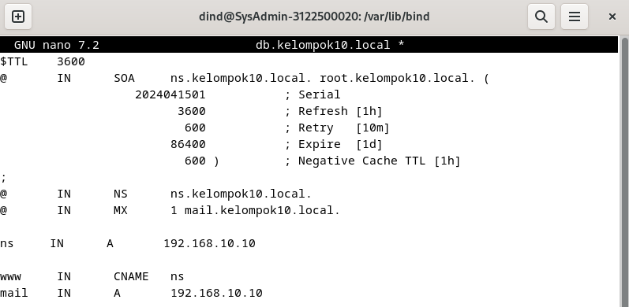
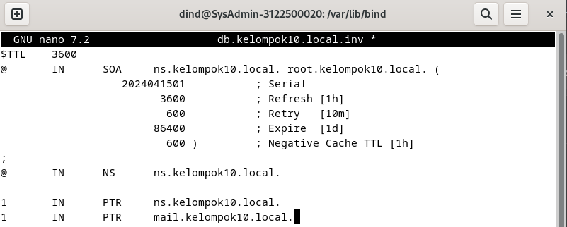
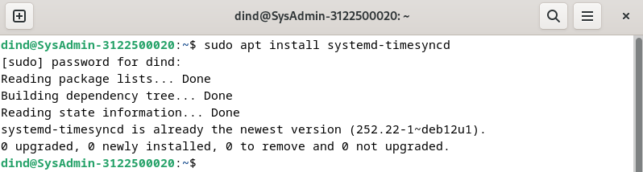
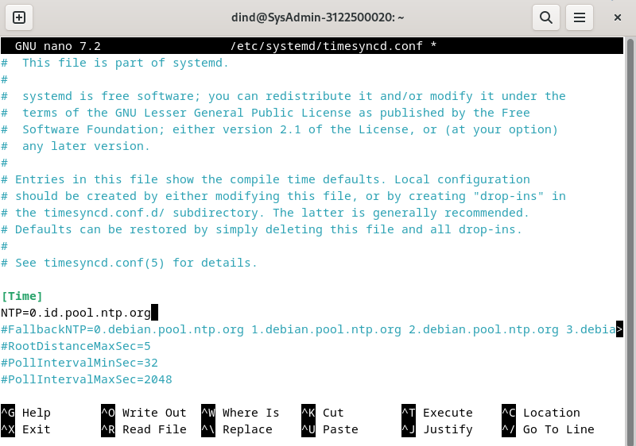
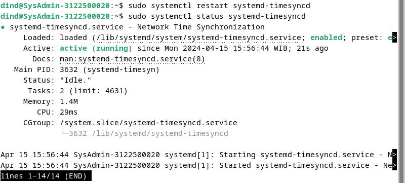

<h1 align="center">LAPORAN WORKSHOP ADMINISTRASI JARINGAN</h1>

<h3 align="center">Dosen Pembimbing: Dr. Ferry Astika Saputra ST, M.Sc</h3>

<p align="center"></p>

<div align="center">
  <h3>Disusun Oleh:</h3>
  <p align="center">Adinda Zahra Qariru 3122500020</p>
</div>

<div align="center">
  <h3>PROGRAM STUDI TEKNIK INFORMATIKA <br>
      POLITEKNIK ELEKTRONIKA NEGERI SURABAYA <br>
      TAHUN 2023/2024 <br>
  </h3>
</div>

##

### Note
Pastikan BIND9 pada praktikum sebelumnya sudah terinstall dan terkonfigurasi sesuai dengan custom domain kelompok.

- Aatur server email pada konfigurasi zona agar dapat diakses melalui ```mail.kelompok10.local.``` <br>
    <br>
    <br>
    <br>
    <br>
- Selanjutnya, gunakan perintah ```nslookup``` untuk melakukan pengecekan.
  <br>

#

### A. Setup NTP ( Network Time Protocol )

1. Mulailah dengan menginstal paket systemd-timesyncd 
   ```
   sudo apt install systemd-timesyncd
   sudo timedatectl set-timezone Asia/Jakarta
   ```
   <br>
2. Ubahlah zona waktu menjadi Asia/Jakarta dan sesuaikan RTC dengan UTC dan aktifkan NTP untuk sinkronisasi waktu.
   ```
   sudo timedatectl set-local-rtc false
   sudo timedatectl set-ntp true
   ```
   <br>
3. Konfigurasikan file ```timesync.d``` untuk menggunakan pool NTP terdekat guna meminimalkan delay.
   ```
   sudo nano /etc/systemd/timesyncd.conf
   ```
   <br>
   <br>
4. Lakukan restart layanan dan periksa statusnya. 
   ```
   sudo systemctl restart systemd-timesyncd
   sudo systemctl status systemd-timesyncd
   ```
   <br>
   Pastikan tanggal sudah terupdate!
   ```
   sudo timedatectl
   ```
   <br>

#

### B. Instalasi dan Konfirgurasi Apache2

1. Instal Apache2
   ```
   sudo apt -y install apache2
   ```
   <br>
2. Konfigurasi Apache2 dengan mengubah pengaturan ServerToken menjadi "Prod".
   ```
   sudo nano /etc/apache2//conf-enabled/security.conf
   ```
   <br>
   <br>
3. Tambahkan direktori yang dapat diakses dan atur ServerName.
   <br>
4. Pastikan email webmaster telah ditetapkan.
   <br>
5. Lakukan reload layanan Apache2.
   <br>
6. Periksa apakah webserver berjalan dengan membuka browser.
   <br>

#

### C. Instalasi PHP 8.2

1. Instal PHP 8.2 dan periksa apakah instalasi berhasil.
   <br>
2. Buat file PHP untuk menguji apakah PHP berjalan dengan baik.
3. Lakukan pengaturan untuk PHP-FM.

#

### D. Instalasi dan Konfigurasi PHP-FM

1. Instal PHP FM 
2. Konfigurasikan file Apache untuk PHP-FM.
3. Jalankan ulang layanan.
4. Uji coba webserver dengan membuat file info.php.

#

### E. Instalasi Database server ( Mariadb-Server )

1. Instal paket Mariadb-Server dan pastikan pengaturan charset sesuai.
2. Lakukan instalasi aman MySQL.
3. Masuk ke dalam MySQL dan cek akses pengguna.
4. Pastikan instalasi MySQL berhasil dengan membuat database dan tabel dummy.

#

### F. Instalasi dan Konfigurasi Email System POSTFIX (SMTP Server)

Instal Postfix dan konfigurasikan manual.
Salin file konfigurasi dan ubah beberapa pengaturan.
Tambahkan konfigurasi anti-spam.

#

### G. Instalasi DOVECOT (IMAP POP3)

Instal paket Dovecot.
Ubah IP yang digunakan.
Lakukan konfigurasi file auth dan mail.
Tambahkan mode dan user serta group pada file master.
Restart layanan dan periksa statusnya.

#

### H. DEBIAN EVOLUTION

Buat user dan lakukan konfigurasi identitas, penerimaan, dan pengiriman email.
Kirim email dan periksa kotak masuk.
Install Roundcube dan lakukan konfigurasi.
Restart dan periksa instalasi Roundcube.
Login sebagai pengguna Debian dan coba kirim email ke pengguna lain.

#

### I. ROUNDCUBE

Lakukan konfigurasi untuk pengguna Roundcube.
Berikan akses penuh.
Instal Roundcube dan lakukan konfigurasi.
Ubah konfigurasi file Apache.
Restart dan pastikan instalasi berhasil.
Login sebagai pengguna dan coba kirim email.